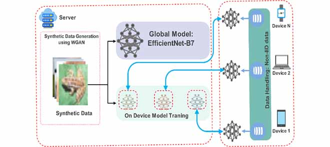
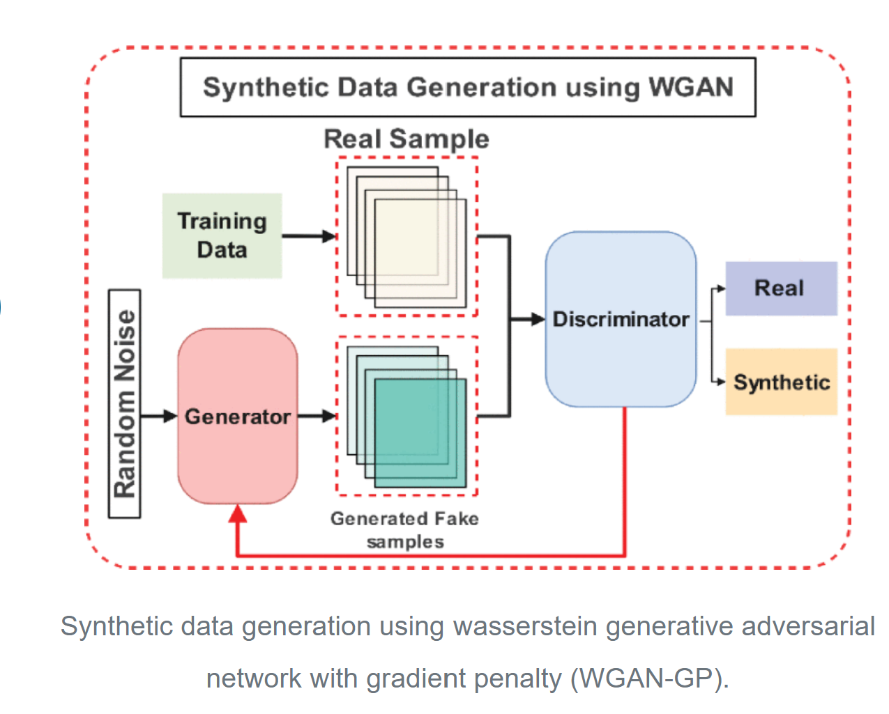
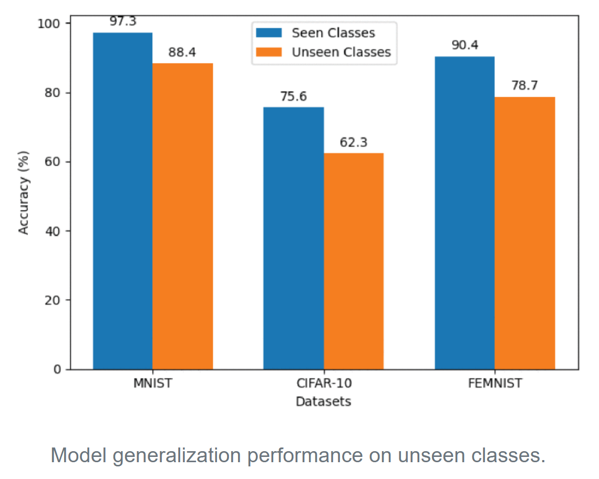
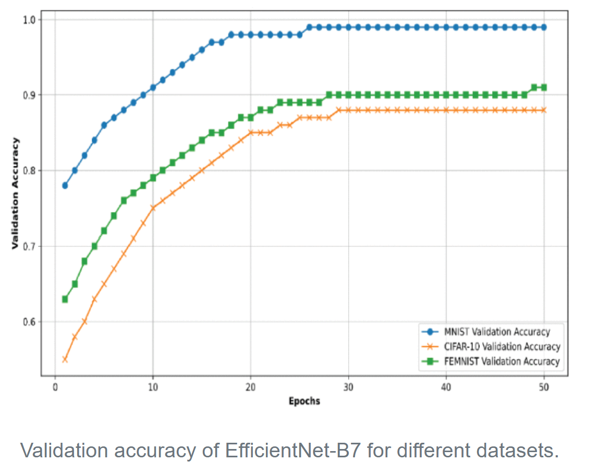
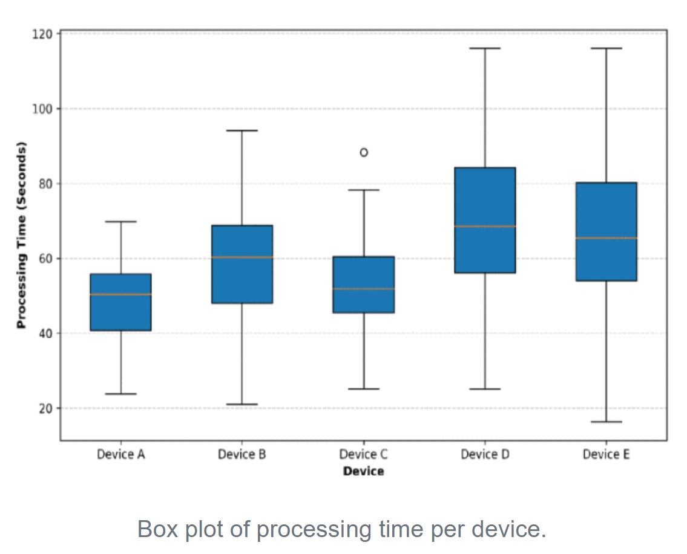
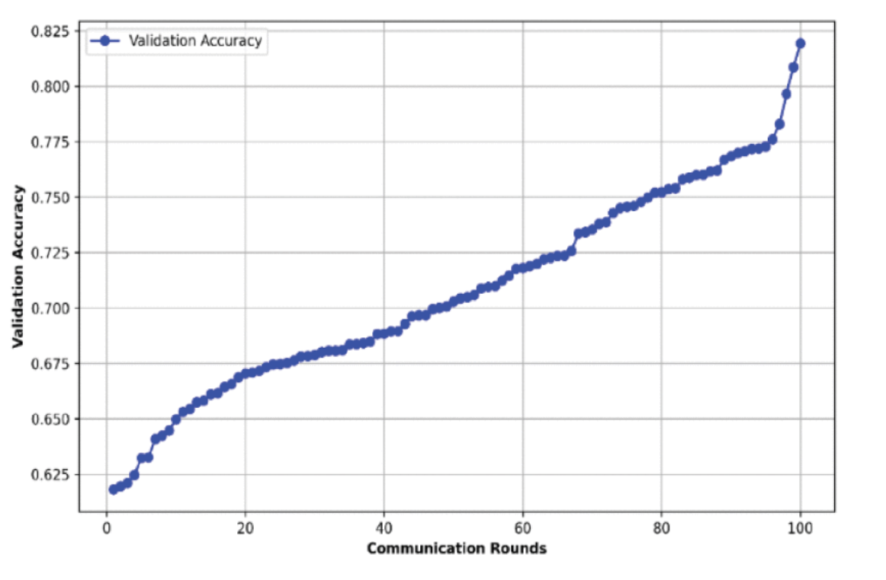

# Advanced Zero-Shot Learning (AZSL) Framework for Secure Model Generalization in Federated Learning

This repository contains the implementation of the AZSL framework for federated learning with Zero-Shot Learning (ZSL). The project includes synthetic data generation using WGAN-GP, global model training with EfficientNet-B7, and integration with TensorFlow Federated.

## Features
- Federated learning with real-world simulation.
- Zero-Shot Learning for unseen class classification.
- Synthetic data generation with WGAN-GP.
- Visualization of learning curves and generalization gap.




## Requirements
- Python 3.8+
- TensorFlow, TensorFlow Federated
- EfficientNet-PyTorch, Matplotlib, NumPy, etc.

## Installation
1. Clone the repository:
   ```
   git clone https: https://github.com/MuhammadAsif-MA/Advanced-Zero-Shot-Learning-AZSL-Framework-for-Secure-Model-Generalization-in-Federated-Learning.git
   ```
2. Install the dependencies:
   ```
   pip install -r requirements.txt
   ```
## Results







## Usage
1. Navigate to the `scripts` directory:
   ```
   cd scripts
   ```
2. Run the main script:
   ```
   python azsl_framework.py
   ```
## Citation

If you use this framework in your research, please cite the following paper:

Link: [https://ieeexplore.ieee.org/document/10776968](https://ieeexplore.ieee.org/document/10776968)

BibTeX:
@article{asif2024advanced,
  title={Advanced Zero-Shot Learning (AZSL) Framework for Secure Model Generalization in Federated Learning},
  author={Asif, Muhammad and Naz, Surayya and Ali, Faheem and Salam, Abdu and Amin, Farhan and Ullah, Faizan and Alabrah, Amerah},
  journal={IEEE Access},
  year={2024},
  publisher={IEEE}
}
## License
This project is licensed under the Creative Commons License.
